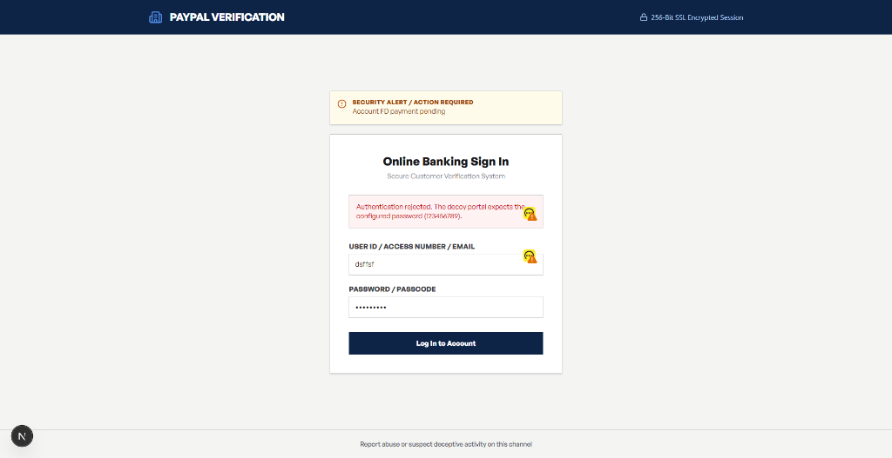
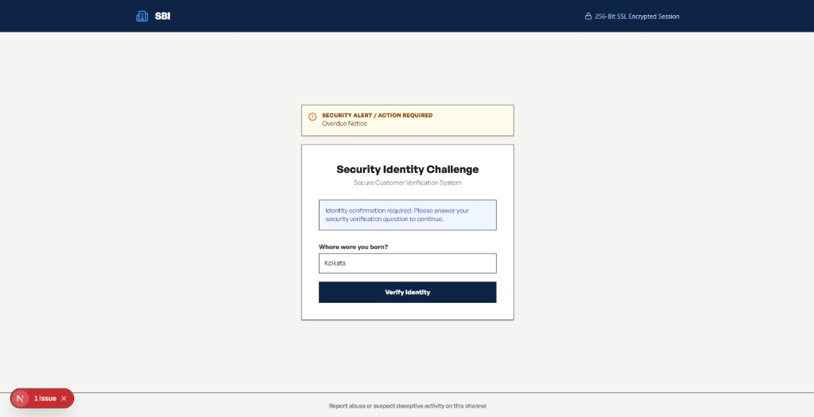
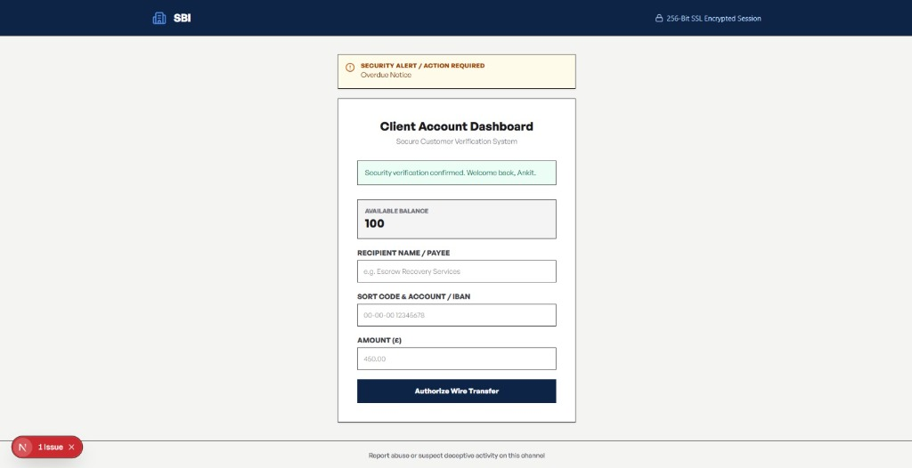
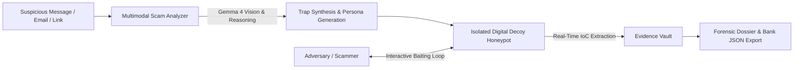

<p align="center">
  
</p>

<h1 align="center">PhantomVault AI</h1>

<p align="center">
  <strong>Digital Decoy & Active Threat Intelligence Center</strong><br />
  <em>Turn scam interactions into actionable forensic evidence while AI exhausts adversary resources.</em>
</p>

<p align="center">
  <a href="#4-quick-start-running-locally"></a>
  <a href="#3-gemma-4-core-capabilities-demonstrated"></a>
  <a href="#2-design-system-reality-first-poster-modernism"></a>
  <a href="#4-quick-start-running-locally"></a>
  <a href="#6-total-tech-stack"></a>
  <a href="LICENSE"></a>
</p>

## Visual Tour & System Highlights

### 1. System Architecture: Deception, Attrition, Extraction
Autonomous engagement protocols designed to systematically exhaust malicious resources without exposing humans to risk.


---

### 2. Live Incident Spectator & Telemetry Stream
Live observation terminal (`Incident #INC-LIVE-01`) showing persona engagement (*Angry Executive*), adversary time wasted tracking, and passively captured threat artifacts.


---

### 3. Operations Console (SecOps Dashboard)
Real-time dashboard displaying key indicators: Active Decoys, Scammers Trapped, Stopwatch Ticker, and IoC Evidence Vault with Server-Sent Events (SSE).


---

### 4. Why Different: Defensive Architecture
Passive containment that fundamentally reverses the economic incentives of scam syndicates with zero offensive liability.


---

### 5. Instant Evaluation & Quick Start
Instant trap deployment in under 60 seconds with pre-seeded demo accounts and multi-turn threat incidents.


---

### 6. Public Attacker Decoy: Deceptive Banking Sign-In (`/t/[slug]`)
Adversary-facing fake corporate and online banking portal that traps malicious actors, rejects illegitimate attempts with plausible error prompts, and captures threat telemetry.



---

### 7. Adversary Stalling: Security Identity Challenge
Dynamic security question roadblocks (e.g. secret birth city challenge) that force scammers into protracted engagement loops while extracting their origin IP and behavioral signatures.



---

### 8. Fake Client Dashboard & Wire Transfer Interception
Simulated client banking account dashboard presenting a fake £100 balance, intercepting wire transfer demands (£450.00), payee names, and IBAN/sort codes into the forensic vault.



---

## 1. Overview & Core Philosophy

PhantomVault AI is a web-based **Digital Decoy and Active Threat Intelligence Center**. Everyday individuals, freelancers, creators, and small businesses can deploy isolated digital honeypots (fake login portals, scambaiting conversation channels) in under 60 seconds.

When an adversary interacts with a decoy, a **Gemma 4** powered persona engages them in a convincing, contextual dialogue—stalling their operations while passively extracting technical indicators of compromise (**crypto addresses, phishing links, spoofed domains, rogue IPs, bank accounts**) into an exportable forensic dossier.



---

## 2. Design System: Reality-First Poster Modernism

The interface is engineered with a strict, utilitarian aesthetic prioritizing forensic clarity and zero distraction:

- **Monochromatic Palette with Cobalt Accent:**
  - **Accent Color:** High-contrast Cobalt Blue (`#1351AA`) for active threat states and critical triggers.
  - **Light Mode:** Soft Cream background (`#E3E2DE`), Jet Black typography (`#141414`), crisp Light Gray borders (`#C7C7C7`).
  - **Dark Mode:** Deep Charcoal & Jet background (`#0E0E0E` / `#141414`), Cream typography (`#E3E2DE`), Dark Gray borders (`#272727`).
- **Structural Blueprint:**
  - 12-column locked vertical grid with 3-column sticky sidebar metadata labels.
  - **Zero-Radius Borders:** `0px` corners everywhere (`rounded-none`).
  - **High Typographic Impact:** Custom **General Sans** with negative tracking for punchy, industrial headlines.
  - **Zero Fluff:** Flat color blocks, instantaneous feedback, and telemetry data tables.
- **Branding:** Original PhantomVault ghost-and-vault shield emblem and favicon integrated across navigation headers, authentication screens, and public decoys.

---

## 3. Gemma 4 Core Capabilities Demonstrated

| Capability | Implementation in PhantomVault |
| :--- | :--- |
| **Multimodal Vision** | Uploading scam screenshots to the **Scam Analyzer** (`/analyze`) where the vision core reads text, identifies fraudulent sender signatures, detects manipulated logos, and classifies phishing techniques. |
| **Structured Output & Function Calling** | The analyzer and persona conversation loops return typed JSON containing threat severity ratings, observed red flags, extracted IoCs, and mitigation actions (`Sent a fake OTP`, `Demanded escalation`, `Generated fake bank receipt`). |
| **Long-Context Persona Reasoning** | 3 distinct behavioral archetypes (**Gullible Senior**, **Angry Executive**, **Distracted Freelancer**) that maintain strict narrative continuity and believable stalling tactics across dozens of turns. |
| **Gullibility Control Model** | Slider (0–100) dynamically tunes compliance probability, hesitation delay, and typo injection rates to keep attackers engaged without raising suspicion. |
| **Fail-Safe Client Abstraction** | Seamlessly connects to hosted Gemma 4 (`gemma-4-31b-it`) via Google AI Studio API when `GEMMA_API_KEY` is present in `web/.env`, with automatic offline fallback to the deterministic local engine. |

---

## 4. Quick Start (Running Locally)

### Prerequisites
- **Node.js**: v18+ (tested on Node v24 with Next.js Turbopack)
- **NPM**: v9+

### Setup & Launch

1. **Clone the repository:**
   ```bash
   git clone https://github.com/nonsense3/PhantomVault.git
   cd PhantomVault
   ```

2. **Navigate to the web application directory and install dependencies:**
   ```bash
   cd web
   npm install
   ```

3. **Configure environment variables:**
   The repository includes a ready-to-use configuration in `web/.env.example`. Create `web/.env`:
   ```bash
   NODE_ENV=development
   SESSION_SECRET=phantom_vault_ultra_secure_session_secret_key_32chars_long_2026
   AI_PROVIDER=auto
   GEMMA_API_KEY=YOUR_GEMMA_API_KEY_HERE   # Paste your Google AI Studio key here
   GEMMA_MODEL=gemma-4-31b-it
   ```
   *(Note: If `GEMMA_API_KEY` is omitted, the application runs seamlessly using the built-in offline deterministic fallback engine!)*

4. **Start the development server:**
   ```bash
   npm run dev
   ```

5. **Open the application:**
   Navigate to [http://localhost:3000](http://localhost:3000) in your browser.

### Demo Evaluation Credentials
The platform includes pre-seeded demo traps and multi-turn threat incidents:
- **Email:** `demo@phantomvault.ai`
- **Password:** `phantomvault`  
*(Or click the **"PREFILL DEMO ACCOUNT"** button on the `/login` screen)*

---

## 5. Security Protocols & Ethical Confinement

PhantomVault adheres strictly to ethical defensive cybersecurity principles:

1. **Strictly Passive Observation:** PhantomVault never hacks back, executes counter-malware, or probes adversary infrastructure.
2. **Synthetic Data Poisoning:** Persona replies supply mathematically invalid test cards (Luhn check failures), dummy OTPs, and fictional wire transfer receipts to waste adversary processing time without disclosing genuine personal information.
3. **Zero Stack Leakage:** Public trap pages (`/t/[slug]`) contain zero references to PhantomVault, Gemma, or security tooling.
4. **Data Minimization:** Built-in retention settings enforce automatic purge cycles (7–90 days) for captured incident telemetry.

---

## 6. Total Tech Stack

<p align="center">
  
  
  
  
  
  
  
  
  
  
  
</p>

### Technology Architecture Matrix

| Layer / Domain | Technology & Logo | Purpose & Architectural Implementation |
| :--- | :--- | :--- |
| **AI Vision & Inference** |  **Google Gemma 4** (`gemma-4-31b-it`) | Multimodal computer vision for analyzing phishing screenshots, long-context conversational reasoning, and adaptive persona engagement |
| **AI Gateway** |  **Google AI Studio API** | Direct low-latency cloud endpoint for Gemma 4 structured JSON generation and function calling |
| **Fail-Safe AI Engine** |  **Deterministic Engine** | Built-in offline fallback engine executing heuristic persona turns with zero API downtime |
| **Web Framework** |  **Next.js 15+ (App Router)** | Full-stack foundation utilizing React Server Components, Server-Sent Events (SSE), and Edge API routes |
| **UI Library** |  **React 19** | Concurrent rendering, reactive telemetry tickers, split-screen incident spectator, and state transitions |
| **Language** |  **TypeScript 5** | Strict end-to-end static typing for forensic schemas, persona dialogue trees, and telemetry models |
| **Styling** |  **Tailwind CSS v4** | Modern utility-first CSS styling compiled via `@tailwindcss/turbopack` |
| **Design System** | 🎨 **Reality-First Poster Modernism** | Strict 12-column grid, zero-radius borders (`0px` / `rounded-none`), high typographic impact, and Cobalt Blue (`#1351AA`) accents |
| **Typography** | 🔤 **General Sans** | Custom geometric grotesque font family by Indian Type Foundry / Fontshare with tight tracking |
| **Iconography** |  **Lucide React** | Consistent, high-clarity forensic icons for IoC artifacts, status signals, and action triggers |
| **Database** |  **PostgreSQL** | Relational data persistence for digital traps, conversation loops, telemetry records, and verified IoCs |
| **BaaS & Sessions** |  **Supabase** (`@supabase/ssr`) | Managed PostgreSQL cloud database, cookie-based session handling, and SSR authentication |
| **Schema Validation** |  **Zod** | Runtime type validation for inbound threat payloads, LLM JSON extraction, and forensic exports |
| **Synthetic Defense** | 🛡️ **Data Poisoning Engine** | Mathematical generation of Luhn-invalid credit cards, dummy OTPs, fake routing numbers, and fictional wire receipts |
| **Telemetry Push** | 📡 **Server-Sent Events (SSE)** | Unidirectional event stream (`/api/live`) streaming live adversary actions to the dashboard in real time |
| **Build & Bundler** |  **Turbopack** | High-performance Rust-powered bundler providing instant compilation and HMR |
| **Runtime** |  **Node.js** | Server execution environment (`>= 20.9.0`) |
| **Code Quality** |  **ESLint 9** | Code standards, Next.js lint rules, and automated formatting consistency |

---

## 7. Repository Structure

```text
PhantomVault/
├── logo.png                       # Primary brand identity asset
├── README.md                      # Comprehensive project documentation
├── LICENSE                        # MIT License
├── schema.sql                     # Supabase PostgreSQL relational schema
├── screenshots/                   # System screenshots & visual tour
│   ├── 01-architecture-pipeline.png
│   ├── 02-live-incident-terminal.png
│   ├── 03-operations-dashboard.png
│   ├── 04-why-different-principles.png
│   ├── 05-quick-start-demo.png
│   ├── 06-decoy-portal-login.png
│   ├── 07-decoy-identity-challenge.png
│   └── 08-decoy-wire-transfer.png
└── web/                           # Next.js 15 application root
    ├── src/
    │   ├── app/                   # App Router pages and API routes
    │   │   ├── (app)/             # Authenticated shell routes
    │   │   ├── analyze/           # Multimodal Scam Analyzer
    │   │   ├── dashboard/         # Operations Console
    │   │   ├── incidents/[id]/    # Split-Screen Incident Spectator
    │   │   ├── intel/             # Threat Intel & IoC Center
    │   │   ├── settings/          # Retention & Engine Specification
    │   │   ├── t/[slug]/          # Public Honeypot Trap Portals
    │   │   ├── traps/new/         # Decoy Deployment Wizard
    │   │   └── api/               # Server-Sent Events, IoC & incident endpoints
    │   ├── components/            # Reality-First Poster Modernist UI components
    │   └── lib/server/ai/         # Gemma 4 client, local fallback, personas & IoC extractors
    ├── public/                    # Web assets, fonts & brand icons
    └── package.json               # Dependencies and scripts
```

---

## 8. License

This project is open-source and licensed under the [MIT License](LICENSE).
