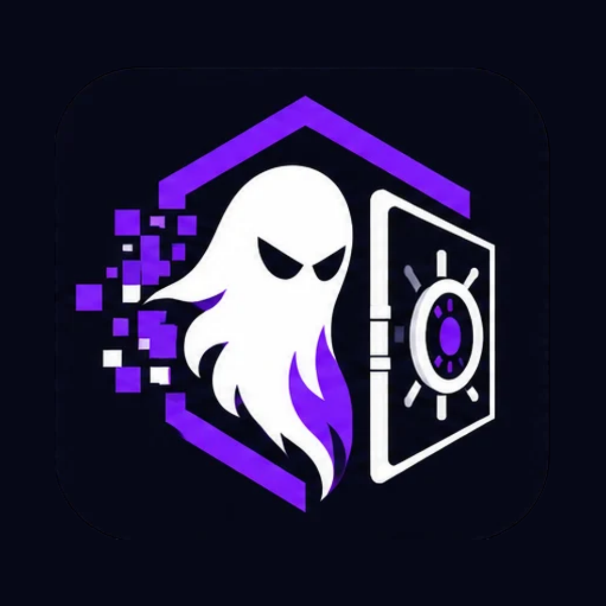
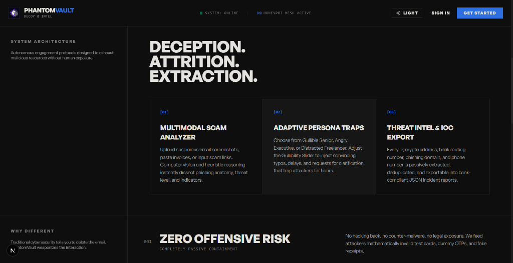
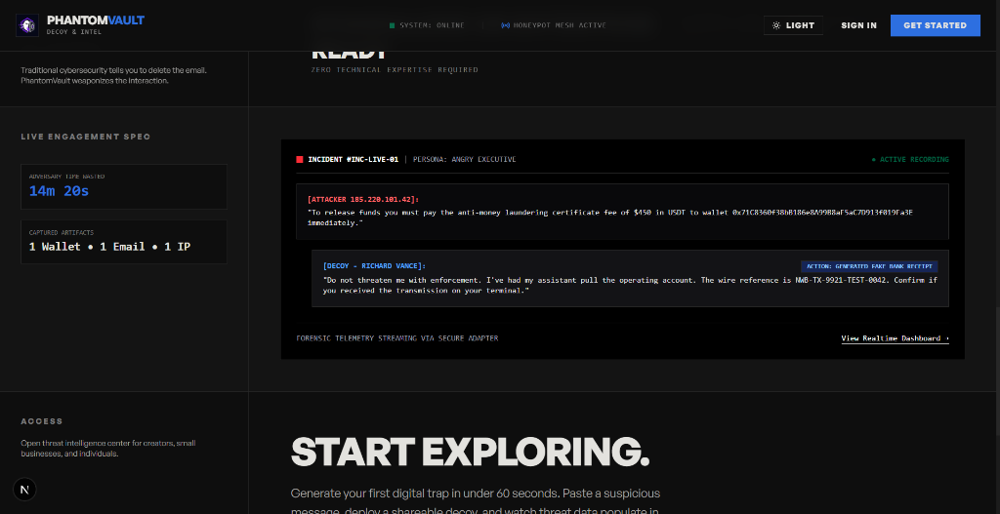
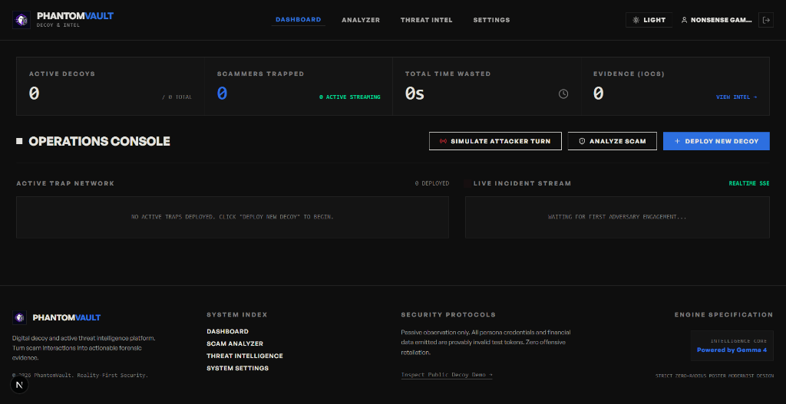
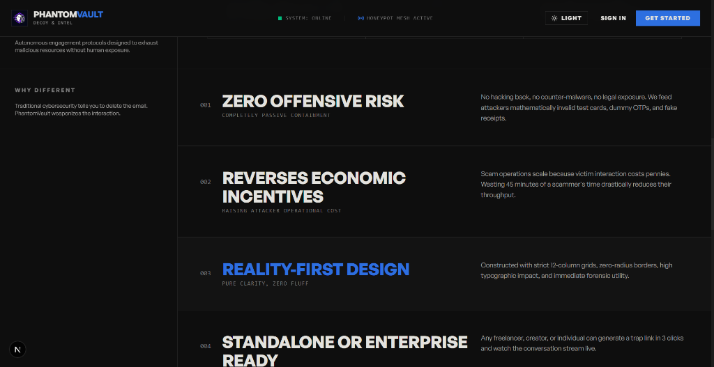
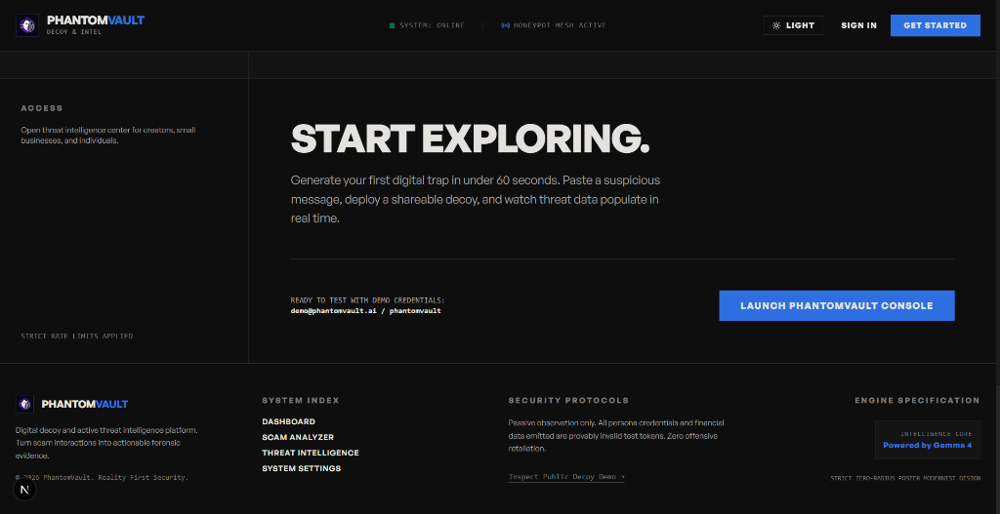
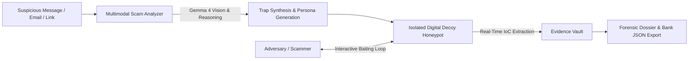

<p align="center">
  
</p>

<h1 align="center">PhantomVault AI</h1>

<p align="center">
  <strong>Digital Decoy & Active Threat Intelligence Center</strong><br />
  <em>Turn scam interactions into actionable forensic evidence while AI exhausts adversary resources.</em>
</p>

<p align="center">
  <a href="#-quick-start-running-locally"></a>
  <a href="#-gemma-4-core-capabilities"></a>
  <a href="#-design-system-reality-first-poster-modernism"></a>
  <a href="#-quick-start-running-locally"></a>
  <a href="LICENSE"></a>
</p>

---

> **Track:** Gemma 4  
> **Version:** 1.0 (Hackathon MVP)   
> *Forward a scam, and let AI waste the scammer's time while you collect the evidence.*

---

## Visual Tour & System Highlights

### 1. System Architecture: Deception, Attrition, Extraction
Autonomous engagement protocols designed to systematically exhaust malicious resources without exposing humans to risk.



---

### 2. Live Incident Spectator & Telemetry Stream
Live observation terminal (`Incident #INC-LIVE-01`) showing persona engagement (*Angry Executive*), adversary time wasted tracking, and passively captured threat artifacts.



---

### 3. Operations Console (SecOps Dashboard)
Real-time dashboard displaying key indicators: Active Decoys, Scammers Trapped, Stopwatch Ticker, and IoC Evidence Vault with Server-Sent Events (SSE).



---

### 4. Why Different: Defensive Architecture
Passive containment that fundamentally reverses the economic incentives of scam syndicates with zero offensive liability.



---

### 5. Instant Evaluation & Quick Start
Instant trap deployment in under 60 seconds with pre-seeded demo accounts and multi-turn threat incidents.



---

## 1. Overview & Core Philosophy

PhantomVault AI is a web-based **Digital Decoy and Active Threat Intelligence Center**. Everyday individuals, freelancers, creators, and small businesses can deploy isolated digital honeypots (fake login portals, scambaiting conversation channels) in under 60 seconds.

When an adversary interacts with a decoy, a **Gemma 4** powered persona engages them in a convincing, contextual dialogue—stalling their operations while passively extracting technical indicators of compromise (**crypto addresses, phishing links, spoofed domains, rogue IPs, bank accounts**) into an exportable forensic dossier.



---

## 2. Design System: Reality-First Poster Modernism

The interface is engineered with a strict, utilitarian aesthetic prioritizing forensic clarity and zero distraction:

- **Monochromatic Palette with Cobalt Accent:**
  - **Accent Color:** High-contrast Cobalt Blue (`#1351AA`) for active threat states and critical triggers.
  - **Light Mode:** Soft Cream background (`#E3E2DE`), Jet Black typography (`#141414`), crisp Light Gray borders (`#C7C7C7`).
  - **Dark Mode:** Deep Charcoal & Jet background (`#0E0E0E` / `#141414`), Cream typography (`#E3E2DE`), Dark Gray borders (`#272727`).
- **Structural Blueprint:**
  - 12-column locked vertical grid with 3-column sticky sidebar metadata labels.
  - **Zero-Radius Borders:** `0px` corners everywhere (`rounded-none`).
  - **High Typographic Impact:** Custom **General Sans** with negative tracking for punchy, industrial headlines.
  - **Zero Fluff:** Flat color blocks, instantaneous feedback, and telemetry data tables.
- **Branding:** Original PhantomVault ghost-and-vault shield emblem and favicon integrated across navigation headers, authentication screens, and public decoys.

---

## 3. Gemma 4 Core Capabilities Demonstrated

| Capability | Implementation in PhantomVault |
| :--- | :--- |
| **Multimodal Vision** | Uploading scam screenshots to the **Scam Analyzer** (`/analyze`) where the vision core reads text, identifies fraudulent sender signatures, detects manipulated logos, and classifies phishing techniques. |
| **Structured Output & Function Calling** | The analyzer and persona conversation loops return typed JSON containing threat severity ratings, observed red flags, extracted IoCs, and mitigation actions (`Sent a fake OTP`, `Demanded escalation`, `Generated fake bank receipt`). |
| **Long-Context Persona Reasoning** | 3 distinct behavioral archetypes (**Gullible Senior**, **Angry Executive**, **Distracted Freelancer**) that maintain strict narrative continuity and believable stalling tactics across dozens of turns. |
| **Gullibility Control Model** | Slider (0–100) dynamically tunes compliance probability, hesitation delay, and typo injection rates to keep attackers engaged without raising suspicion. |
| **Fail-Safe Client Abstraction** | Seamlessly connects to hosted Gemma 4 (`gemma-4-31b-it`) via Google AI Studio API when `GEMMA_API_KEY` is present in `web/.env`, with automatic offline fallback to the deterministic local engine. |

---

## 4. Key Screens & Route Index

- **`/` — Landing Page:** Manifesto, 12-column System Architecture grid, live terminal spectator preview (`Incident #INC-LIVE-01`), Why Different comparisons, and theme toggle.
- **`/login` & `/register` — Authentication:** Privacy-focused auth with one-click **"PREFILL DEMO ACCOUNT"** button.
- **`/dashboard` — Operations Console:**
  - Real-time KPI cards: Active Decoys, Scammers Trapped, Live Time Wasted stopwatch ticker, IoC count.
  - Active Trap Network table with quick pause/resume toggles and shareable link copying.
  - **Live Incident Stream** updating in real time via Server-Sent Events (`/api/live`).
  - **"Simulate Attacker Turn"** button to inject live adversarial actions during evaluations.
- **`/analyze` — Scam Analyzer:**
  - Multimodal analysis tab (raw text, suspicious URL, or screenshot upload).
  - Quick sample threat loader (AML Escrow Scam, Bank SMS, Overdue Invoice).
  - Detailed threat classification card with observed red flags and extracted IoCs.
  - One-click **"Turn into Decoy Trap"** prefill button.
- **`/traps/new` — Honeypot Deployment:**
  - Choose between *Forward-a-Scam Page* and *Fake Login Portal (Northwind Secure Bank)*.
  - Select persona archetype and configure the 0–100 Gullibility Index slider.
- **`/incidents/[id]` — Split-Screen Spectator View:**
  - Left pane: Adversary inbound transmissions.
  - Right pane: Decoy persona responses with typed action badges.
  - Live scammer time-wasted counter.
  - Interactive **"Simulate Scammer Turn"** button.
  - Evidence Vault tray with one-click copyable indicators.
  - **Export Evidence (JSON)** formatted for banks and authorities.
- **`/intel` — Threat Intelligence Center:**
  - Filterable IoC table (Crypto Wallets, Emails, Domains, URLs, IPs, Bank Accounts, Phone Numbers).
  - Search by address, domain, or indicator value with full JSON export.
- **`/settings` — Security & Policies:**
  - Data minimization retention slider (7–90 days).
  - Ethical confinement rules.
  - Designated **"Powered by Gemma 4"** specification badge.
- **`/t/[slug]` — Public Attacker Decoy:**
  - Zero tech-stack leakage (no vendor hints, clean fictional corporate branding).
  - Interactive fake bank login portal or personal reply channel.
  - Ethical abuse report modal at the footer.

---

## 5. Quick Start (Running Locally)

### Prerequisites
- **Node.js**: v18+ (tested on Node v24 with Next.js Turbopack)
- **NPM**: v9+

### Setup & Launch

1. **Clone the repository:**
   ```bash
   git clone https://github.com/nonsense3/PhantomVault.git
   cd PhantomVault
   ```

2. **Navigate to the web application directory and install dependencies:**
   ```bash
   cd web
   npm install
   ```

3. **Configure environment variables:**
   The repository includes a ready-to-use configuration in `web/.env.example`. Create `web/.env`:
   ```bash
   NODE_ENV=development
   SESSION_SECRET=phantom_vault_ultra_secure_session_secret_key_32chars_long_2026
   AI_PROVIDER=auto
   GEMMA_API_KEY=YOUR_GEMMA_API_KEY_HERE   # Paste your Google AI Studio key here
   GEMMA_MODEL=gemma-4-31b-it
   ```
   *(Note: If `GEMMA_API_KEY` is omitted, the application runs seamlessly using the built-in offline deterministic fallback engine!)*

4. **Start the development server:**
   ```bash
   npm run dev
   ```

5. **Open the application:**
   Navigate to [http://localhost:3000](http://localhost:3000) in your browser.

### Demo Evaluation Credentials
The platform includes pre-seeded demo traps and multi-turn threat incidents:
- **Email:** `demo@phantomvault.ai`
- **Password:** `phantomvault`  
*(Or click the **"PREFILL DEMO ACCOUNT"** button on the `/login` screen)*

---

## 6. Security Protocols & Ethical Confinement

PhantomVault adheres strictly to ethical defensive cybersecurity principles:

1. **Strictly Passive Observation:** PhantomVault never hacks back, executes counter-malware, or probes adversary infrastructure.
2. **Synthetic Data Poisoning:** Persona replies supply mathematically invalid test cards (Luhn check failures), dummy OTPs, and fictional wire transfer receipts to waste adversary processing time without disclosing genuine personal information.
3. **Zero Stack Leakage:** Public trap pages (`/t/[slug]`) contain zero references to PhantomVault, Gemma, or security tooling.
4. **Data Minimization:** Built-in retention settings enforce automatic purge cycles (7–90 days) for captured incident telemetry.

---

## 7. Tech Stack & Repository Structure

```text
PhantomVault/
├── logo.png                       # Primary brand identity asset
├── README.md                      # Comprehensive project documentation
├── schema.sql                     # Supabase PostgreSQL relational schema
├── screenshots/                   # System screenshots & visual tour
│   ├── 01-architecture-pipeline.png
│   ├── 02-live-incident-terminal.png
│   ├── 03-operations-dashboard.png
│   ├── 04-why-different-principles.png
│   └── 05-quick-start-demo.png
└── web/                           # Next.js 15 application root
    ├── src/
    │   ├── app/                   # App Router pages and API routes
    │   │   ├── (app)/             # Authenticated shell routes
    │   │   ├── analyze/           # Multimodal Scam Analyzer
    │   │   ├── dashboard/         # Operations Console
    │   │   ├── incidents/[id]/    # Split-Screen Incident Spectator
    │   │   ├── intel/             # Threat Intel & IoC Center
    │   │   ├── settings/          # Retention & Engine Specification
    │   │   ├── t/[slug]/          # Public Honeypot Trap Portals
    │   │   ├── traps/new/         # Decoy Deployment Wizard
    │   │   └── api/               # Server-Sent Events, IoC & incident endpoints
    │   ├── components/            # Reality-First Poster Modernist UI components
    │   └── lib/server/ai/         # Gemma 4 client, local fallback, personas & IoC extractors
    ├── public/                    # Web assets, fonts & brand icons
    └── package.json               # Dependencies and scripts
```

---

## 8. License

This project is open-source and licensed under the [MIT License](LICENSE).
